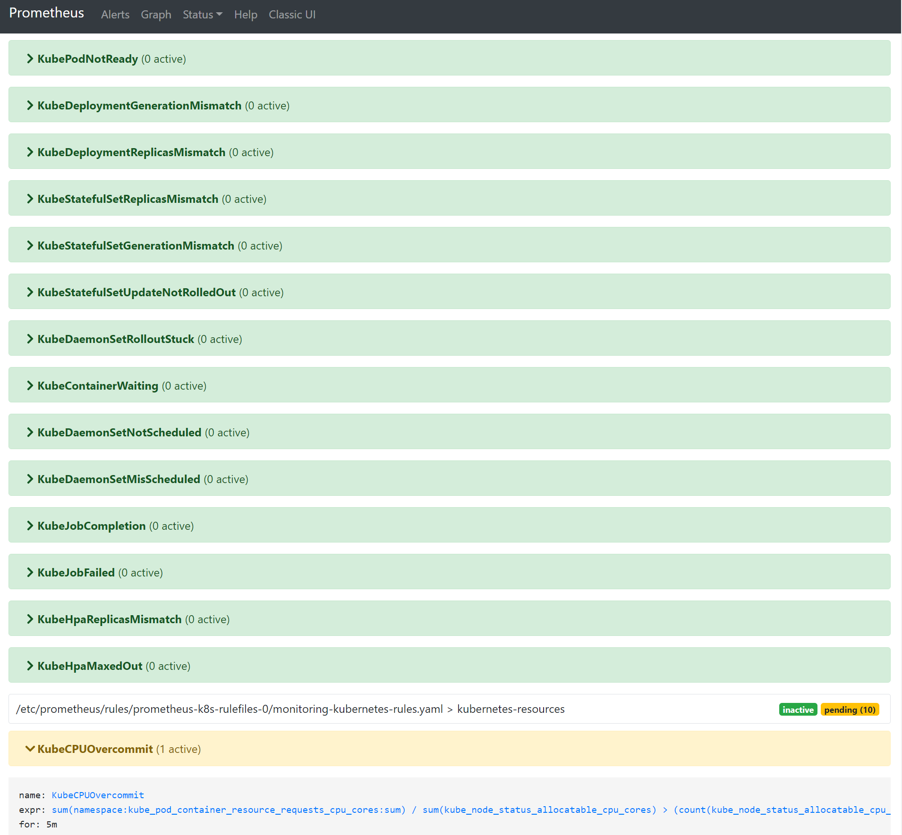
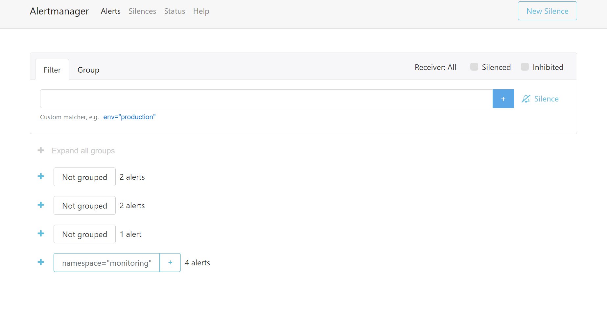
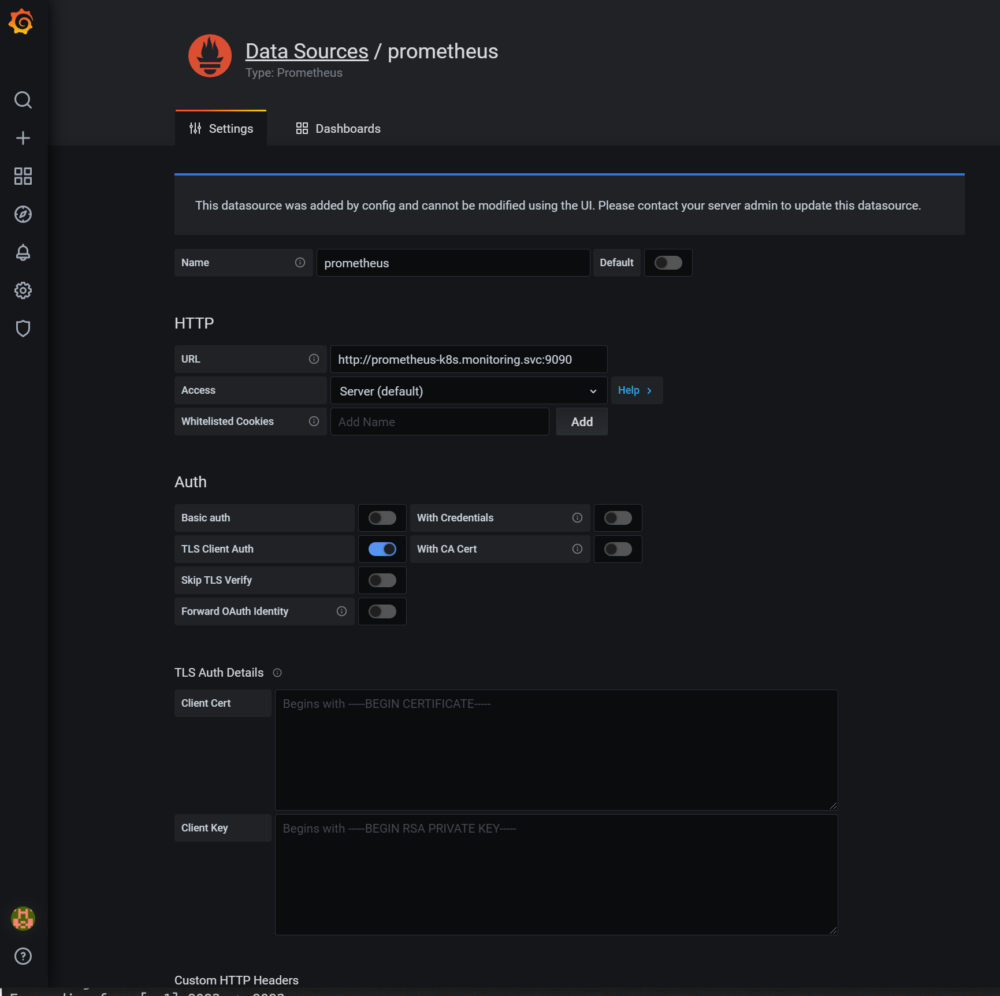

# Prometheus Deployment

The highest scoring tool in the report was Prometheus, hence I will explain the steps I took to implement this tool in our Kubernetes cluster.

First, I'd like to make clear that I have not written any of these files. This was my first time working with Kubernetes and any monitoring tool outside of AWS so my experience was limited (unexistent). After these couple of days inmersed in it, I have taken baby steps towards setting up Kubernetes cluster and choosing monitoring for it as well as understanding what it's needed for the whole system to work.

At the begining, I was trying to follow few tutorials that talked about how to set up prometheus via manifest. The main way of doing it without Helm is with the prometheus operator. After much fidling around with the files to fix the errors, changing kubernetes version in minikube and so on I gave [kube-prometheus](https://github.com/prometheus-operator/kube-prometheus) repository a try.

They have a quick start guide that worked for me and that's what I will explain in here.

### Quickstart

1. start minikube with this command
```
$ minikube delete && minikube start --kubernetes-version=v1.20.0 --memory=6g --bootstrapper=kubeadm --extra-config=kubelet.authentication-token-webhook=true --extra-config=kubelet.authorization-mode=Webhook --extra-config=scheduler.address=0.0.0.0 --extra-config=controller-manager.address=0.0.0.0
```
2. Switch off metrics-server addon is disabled on minikube

```
$ minikube addons disable metrics-server
```

3. Grab the manifest that I have copied in this repository, save them and navigate to it folder. Then run this command
```
# Create the namespace and CRDs, and then wait for them to be availble before creating the remaining resources
kubectl create -f manifests/setup
until kubectl get servicemonitors --all-namespaces ; do date; sleep 1; echo ""; done
kubectl create -f manifests/
```

### Access the dashboards

#### Prometheus

```
$ kubectl --namespace monitoring port-forward svc/prometheus-k8s 9090
```
Then it will be available at http://localhost:9090



#### Alert Manager

```
$ kubectl --namespace monitoring port-forward svc/alertmanager-main 9093
```

Then it will be available at http://localhost:9093



#### Grafana

```
$ kubectl --namespace monitoring port-forward svc/grafana 3000
```

Then it will available at http://localhost:3000  *use the default grafana user:password of* `admin:admin` 

